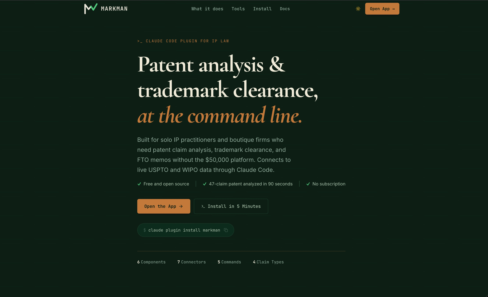
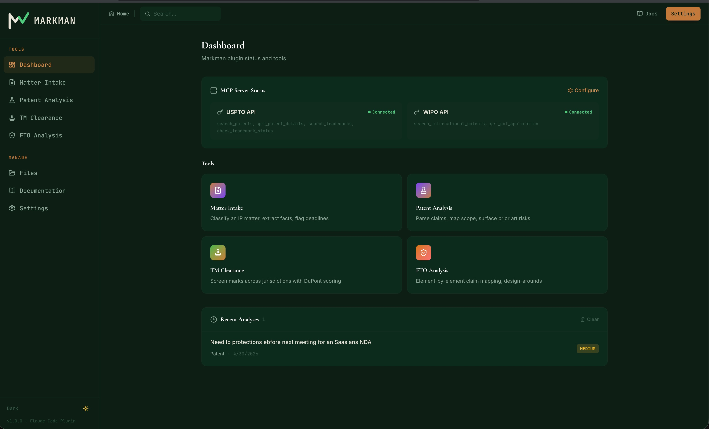
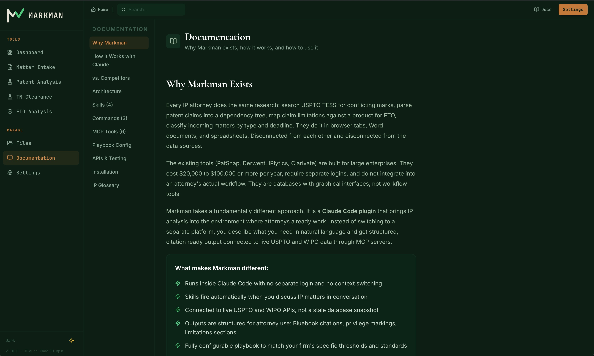
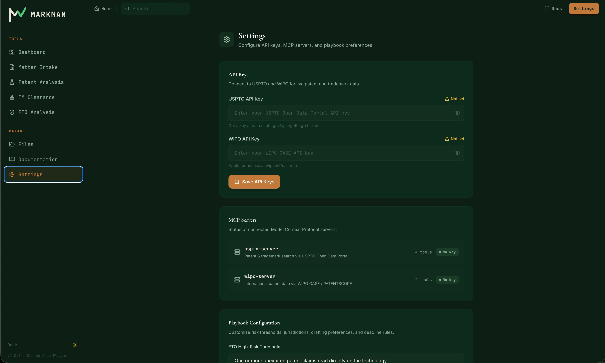

# Markman

A Claude Code plugin for intellectual property law. Patent claim analysis, trademark clearance, FTO memos, matter intake, deadline tracking, matter history, and Word document export. Connected to live USPTO and WIPO data.

**This plugin does not provide legal advice.** All AI-generated analysis must be reviewed by licensed attorneys before reliance.









## What it does

Markman teaches Claude Code how to do structured IP work. You describe what you need in natural language. Claude reads the skill definitions, calls the USPTO and WIPO APIs through MCP servers, references your firm's playbook for risk thresholds and standards, and produces formatted legal analysis output.

```
You: Analyze the claims in US11,234,567

Claude: [reads patent-analysis skill]
        [calls get_patent_details via USPTO MCP server]
        [references playbook for claim drafting preferences]
        [outputs structured claim map, scope assessment, prior art flags]
```

## Components

**Skills** (fire automatically):
- `patent-analysis` — parse claims, map scope, flag Alice/KSR issues
- `fto-memo` — element-by-element claim mapping, non-infringement arguments, design-arounds
- `trademark-screen` — identical/similar mark search, DuPont factor scoring, jurisdiction coverage
- `ip-triage` — classify IP type, extract facts, identify deadlines, assign risk

**Commands** (invoke explicitly):
- `/review-claims` — analyze a patent by number or pasted claims
- `/fto-analysis` — FTO assessment for a described technology
- `/tm-clearance` — screen a proposed trademark
- `/deadlines` — view, add, and manage tracked IP deadlines
- `/history` — search past analyses
- `/export-memo` — export analysis as formatted Word document

**MCP Servers** (3 servers, 12 tools):
- `uspto-server` — patent search, patent details, trademark search, trademark status (api.uspto.gov)
- `wipo-server` — international patent search, PCT application details (wipocase.wipo.int)
- `markman-store` — deadline tracking, matter history, Word export (local storage)

**Playbook** (configurable):
- FTO risk thresholds (HIGH/MEDIUM/LOW with required actions)
- Trademark clearance jurisdictions and recommendation thresholds
- Patent claim drafting preferences
- Deadline rules with alert intervals (90/60/30/7 days)

## Installation

Requires Node.js 18+ and Claude Code.

```bash
# Clone and install
git clone https://github.com/Muna0/markman.git
cd markman
npm install

# Add your API keys
echo "USPTO_API_KEY=your_key" > .env
echo "WIPO_API_KEY=your_key" >> .env

# Update .mcp.json with your key values

# Install the plugin
claude plugin install ./
```

### Getting API keys

**USPTO** (free): Go to data.uspto.gov/myodp. Create a USPTO.gov account, verify with ID.me, and request an API key. The key covers both patent and trademark data.

**WIPO** (free): Go to wipo.int/case/en. Apply for API access. Approval may take 1-3 business days.

### Testing without API keys

The skills still work without API keys. Claude uses its training knowledge to analyze patents and trademarks you paste in directly. The APIs add real-time data lookup by patent number or trademark serial number.

## Usage

Once installed, use Markman by talking to Claude Code naturally or using slash commands:

```
# Natural language (skills fire automatically)
You: We're developing an ML recommendation engine. Need to check
     if it infringes any existing patents.

# Slash commands (explicit invocation)
You: /review-claims US11,234,567
You: /tm-clearance NEXAFLOW | SaaS workflow software | US, EU, UK
You: /fto-analysis Transformer-based medical NER with FHIR output

# Deadline management
You: /deadlines
You: /deadlines add "ML Patent" "Provisional filing" "2026-05-15"

# Search past work
You: /history patent
You: /history NEXAFLOW

# Export to Word
You: /export-memo
```

## Project structure

```
markman/
├── .claude-plugin/plugin.json    # Plugin manifest (v1.1.0)
├── .mcp.json                     # MCP server configuration
├── mcp/
│   ├── uspto-server.js           # USPTO API (4 tools)
│   ├── wipo-server.js            # WIPO API (2 tools)
│   └── markman-store.js          # Local store (6 tools)
├── skills/
│   ├── patent-analysis.md
│   ├── fto-memo.md
│   ├── trademark-screen.md
│   └── ip-triage.md
├── commands/
│   ├── review-claims.md
│   ├── fto-analysis.md
│   ├── tm-clearance.md
│   ├── deadlines.md
│   ├── history.md
│   └── export-memo.md
├── playbooks/ip-playbook.md
├── markman-data/                 # Local storage (gitignored)
│   ├── deadlines.json
│   ├── history.json
│   └── exports/
├── frontend/                     # Web dashboard (optional)
└── markman.html                  # Standalone marketing page
```

## Customization

Edit `playbooks/ip-playbook.md` to match your firm's standards. The playbook controls risk thresholds, jurisdiction requirements, claim drafting preferences, deadline rules, and output formatting across all skills.

## License

Apache-2.0
